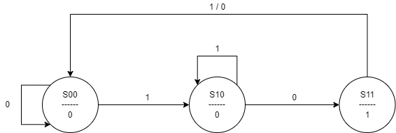

<h1>
b) Dieser Automat soll implementiert werden. Hierzu werden zunächst noch Vorüberlegungen angestellt. Bitte beantworten Sie die folgenden Fragen in ca. 1-3
ganzen Sätzen: 
 - Welchen Automatentyp würden Sie für eine Implementierung auswählen? Warum? 
 - Wie viele Zustände benötigen Sie? 
 - Zeichnen Sie das Automatendiagramm (Zustände als Kreise, Zustandsübergänge 
als Pfeile)
</h1>

Durch die zeitlich Verzögerung von Input und Output würde ich einen Moore-Automaten für die Implementation auswählen. 
Der Moore-Automat würde 3 Zustände haben S00, S10 und S11. 
 
Knödeldiagramm des Moore-Automaten:

